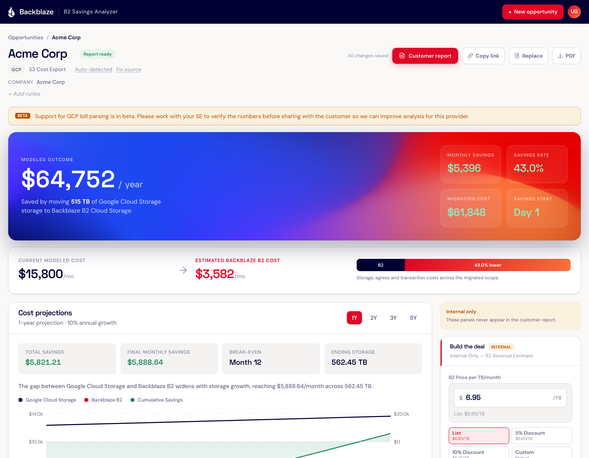

# Backblaze B2 Savings Analyzer

Internal tool for Backblaze Solutions Engineering. Upload a customer's cloud storage bill, isolate addressable storage spend, and model the savings from migrating to Backblaze B2.

Produces an interactive internal dashboard for AE/SE analysis and a customer-facing report/PDF that frames savings in customer-ready language.



## What It Does

1. **Upload** — drag in an AWS or GCP bill (PDF, CSV, or Excel)
2. **Parse** — deterministic parsers extract storage tiers, egress, transactions, and discounts
3. **Model** — choose migration tiers, configure egress/data growth, test B2 price/term scenarios, and see real-time savings
4. **Report** — generate a branded customer report that explains what they save, what Backblaze covers, and the assumptions used

### Supported Bill Formats

| Provider | Format | Detail Level |
|----------|--------|-------------|
| AWS | Detailed billing PDF | Full per-SKU breakdown |
| AWS | S3 cost export CSV | Per-SKU with usage quantities |
| AWS | Summary invoice PDF | Service-level totals (estimated GB) |
| GCP | Cost table CSV | Full per-SKU breakdown |
| Any | Excel (.xlsx) | Auto-detected sheet → CSV |

### Key Features

- **Tier-grouped storage inventory** — Standard/hot storage is selected by default, cooler tiers are grouped and expandable, and each tier includes region/location detail plus help links
- **Transaction cost analysis** — groups source transaction line items by B2 transaction class, separates unsupported or non-applicable items into Other, and keeps source line-item detail expandable
- **Egress modeling** — decision tree for compute location, partner CDN, UDM
- **Data growth modeling** — choose annual percentage growth or fixed TB/month growth for projections and deal sizing
- **Custom pricing detection** — flags EDP, Savings Plans, private rate cards, and list-price vs. discounted storage rates, ordered by price with clear region names
- **Centralized pricing data** — AWS/Azure/GCP/R2/B2 prices flow through JSON-backed lookup helpers
- **1/2/3/5-year cost projections** — modeled current-provider cost, Backblaze B2 cost, cumulative savings, data stored, and break-even timing
- **Deal sizing** (internal) — editable B2 price/TB, quick discount presets, ARR/TCV summaries at list/current/custom price, contract term slider, growth controls, and copy-ready Salesforce/Slack handoff text
- **Customer report generation** — customer-facing summary, storage tier comparison, UDM-covered migration egress cost, projection assumptions, and pricing freshness warnings when applicable
- **Magic link auth** — scoped to `@backblaze.com` email domain

## Prerequisites

- **Node.js** 20+
- **pdftotext** (from Poppler) — required for PDF parsing
  ```sh
  brew install poppler        # macOS
  apt install poppler-utils   # Linux
  ```
- A **Backblaze B2** bucket for persistence (S3-compatible API)
- A **Resend** account for magic link emails (free tier works)

## Setup

```sh
git clone https://github.com/udarag/B2-Savings-Analyzer.git
cd B2-Savings-Analyzer
npm install
```

Create `.env.local`:

```env
# B2 Storage (S3-compatible)
B2_ENDPOINT=https://s3.us-west-004.backblazeb2.com
B2_REGION=us-west-004
B2_KEY_ID=<your-key-id>
B2_APP_KEY=<your-app-key>
B2_BUCKET_NAME=<your-bucket>

# Auth
AUTH_SECRET=<random-32-char-string>
ALLOWED_EMAIL_DOMAIN=backblaze.com

# Email (Resend)
RESEND_API_KEY=<your-resend-key>

# App
NEXT_PUBLIC_BASE_URL=http://localhost:3000

# Optional: enables API-backed GCP pricing refreshes
GCP_CLOUD_BILLING_API_KEY=<your-google-cloud-api-key>
```

```sh
npm run dev
```

## Tech Stack

- **Next.js 16** (App Router) + React 19 + TypeScript
- **Tailwind CSS v4** with custom Backblaze theme
- **Backblaze B2** as sole persistence layer (no database)
- **pdftotext** for PDF text extraction
- **Recharts** for projection charts
- **Playwright** for PDF report generation
- **jose** for JWT-based magic link auth
- **Resend** for email delivery

## Project Structure

```
src/
├── app/                    # Next.js App Router pages & API routes
│   ├── analyses/[id]/      # Dashboard + report pages
│   ├── api/analyses/       # REST API (CRUD, upload, PDF generation)
│   └── login/              # Magic link auth flow
├── components/
│   ├── dashboard/          # TierInventory, CostBreakdown, TransactionAnalysis, etc.
│   ├── upload/             # FileUpload, ParseReview
│   └── shared/             # FormatCurrency, InlineEditText, UserMenu
├── lib/
│   ├── parsers/            # Bill parsers (AWS PDF/CSV, GCP CSV, detection)
│   ├── engine/             # Cost model, tier inventory, egress, projections
│   ├── pricing/            # Provider pricing JSON, lookup gateway, freshness checks, pricing detection
│   ├── storage/            # B2 S3-compatible persistence layer
│   ├── storage-tiers.ts    # Tier explanations and docs links
│   ├── regions.ts          # Provider region/location labels
│   └── auth/               # Magic link tokens + session management
└── types/                  # TypeScript interfaces
```

## Pricing Data

Provider pricing is kept in `src/lib/pricing/*.json` and accessed through `src/lib/pricing/lookup.ts`. Avoid hardcoding cloud rates in components, parsers, or model code.

- `b2.json` contains B2 storage, egress, transaction, Reserve, UDM, and Overdrive assumptions.
- `aws.json` contains multi-region S3 storage pricing refreshed from AWS Bulk Pricing APIs, including the dedicated S3 Glacier Deep Archive offer.
- `azure.json` contains multi-region Blob Storage pricing refreshed from the Azure Retail Prices API.
- `gcp.json` can be refreshed from the Google Cloud Billing Catalog API when `GCP_CLOUD_BILLING_API_KEY` is configured. Without that key, the script leaves GCP pricing unchanged and prints the manual verification links.
- `r2.json` and `b2.json` are static pricing assumptions because no stable public pricing API is configured for those sources.
- If a refresh is skipped or errors because an API key is missing, invalid, rate-limited, or otherwise unavailable, the analysis dashboard and customer report show a warning that affected pricing may be stale or inaccurate.

Refresh supported pricing data with:

```sh
npm run refresh-pricing
```

You can also target one provider:

```sh
npm run refresh-pricing -- aws
npm run refresh-pricing -- azure
npm run refresh-pricing -- gcp
```

## TODOs

### Unfinished Features

- [ ] **Transaction analysis for summary invoices** — Summary invoices (like Azira's) have no per-SKU operations data, so the Transaction Cost Analysis section doesn't appear. Need to either estimate operations from service totals or surface a note prompting the AE to request the detailed bill.
- [ ] **PDF report — end-to-end testing** — The Playwright-based PDF generation route and 4-page report layout exist but haven't been verified with real data. Need to generate a PDF and confirm all pages render correctly.
- [ ] **Egress questionnaire → model validation** — The egress decision tree UI is built, but the full flow (compute stays in hyperscaler → new costs appear, partner CDN → egress zeroes out) hasn't been validated against real egress numbers from a bill.
- [ ] **AI-assisted egress profile and AE/SE follow-up questions** — Current bill-derived egress guesses and follow-up questions are deterministic prompts based on parsed bill signals. A future improvement could use AI to synthesize sharper profile suggestions and questions from the full bill context, customer notes, detected services, egress profile, and likely B2 architecture fit.
- [ ] **Projection model validation** — Projection growth compounding and fixed TB/month growth exist but should be cross-checked against a manual spreadsheet calculation with real customer numbers.
- [ ] **Manual line-item editing** — Parse review currently summarizes parsed categories and warnings. Inline editing of parsed line-item values still needs to be added or reintroduced, then verified against downstream recalculation.

### Testing Against Real Bills

> **Note to the team:** We all should be pushing our AEs to gather bills from customers so we can use the data to make this tool better. Every new bill format we test against makes the parsers more robust and the savings models more accurate. Drop bills in your local `bills/` directory (gitignored — customer data stays local).

- [ ] **AWS detailed billing PDF** — Verify per-SKU line items, storage class mapping (Standard, Standard-IA, Glacier, etc.), operations subcategories in Transaction Analysis, egress categorization, and grand total reconciliation.
- [ ] **GCP cost table CSV** — Verify Class A / Class B operations parse with storage class attribution, GiB → GB normalization, Nearline/Coldline/Archive tier inventory, and savings programs discount detection.
- [ ] **AWS S3 cost export CSV** — Test with a real export. Verify pivoted SKU columns (TimedStorage, Requests-Tier1, etc.) parse correctly and monthly breakdowns work.
- [ ] **AWS summary invoice edge cases** — Bills with fewer linked accounts, no discounts, $0 services, or different formatting/layout variations.
- [ ] **Excel (.xlsx)** — Test with a real Excel export to verify sheet detection and CSV conversion.
- [ ] **Multi-region bills** — Verify region-specific pricing (e.g., Singapore vs US East) produces separate tier inventory rows with correct effective rates.
- [ ] **Discount accuracy** — Verify named discounts (EDP, Savings Plans, Private Rate Card) are correctly extracted and pricing detection flags them accurately.

### Future: Database

The app currently uses B2 object storage as its sole persistence layer — no database. Adding a database (e.g., Postgres or SQLite) would unlock:

- [ ] **Team analytics dashboard** — Aggregate savings across all AEs and prospects to surface trends like "average savings % by provider" or "top 10 opportunities by ARR." Not feasible today because each analysis is an isolated JSON file with no cross-query capability.
- [ ] **Audit trail and version history** — Track every change to an analysis (who toggled which tier, when pricing was adjusted, previous model configs) so AEs and managers can review the decision history. Object storage only keeps the latest state.
- [ ] **Collaboration and sharing** — Let multiple AEs or SEs work on the same opportunity with role-based access, comments, and notifications. Current user-scoped B2 prefixes make cross-user access impractical.

## Adding Bills for Testing

Place test bills in a `bills/` directory (gitignored — customer data stays local):

```sh
mkdir bills
cp ~/path/to/test-bill.pdf bills/
```

---

Authored by Udara. Pair-programmed with a statistically significant amount of Claude.
